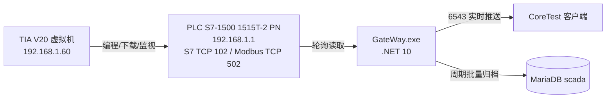

# 真实 PLC 实测链路与 SharpSCADA 迁移说明

> 首次部署先运行：
> - powershell -File <REPO_ROOT>\config\Sync-DataConfig.ps1
> - powershell -File <REPO_ROOT>\config\Update-PathsProps.ps1


本文档简要说明真实 PLC（S7-1500）的实测链路、相对原版 SharpSCADA 已完成的
迁移成果、网关侧 S7 / Modbus TCP 的切换方法，以及后续扩展其他协议的大致路径。

## 1. 实测链路



整条链路已经实测跑通：

1. PLC 程序里既有 DB1（非优化访问），又有 `MB_SERVER` 指令，把 DB1 同时映射为
   S7 绝对地址和 Modbus 保持寄存器 40001-40006。
2. 网关按 `meta_group` 的轮询周期读取标签，Modbus 走 192.168.1.1:502（FC3），
   S7 走 192.168.1.1:102（PUT/GET）。
3. 实时值通过 6543 端口推送给 CoreTest 客户端，1 秒内刷新。
4. 开启归档的标签按 `Cycle=1000ms` 采样，按 `server.xml` 的 HDA 周期批量写入
   `scada.log_hdata`。

### 实测结果

| 项目 | 结果 |
| --- | --- |
| S7 实时读 | `1002=1234`、`1004=3.14`、`1001=1` |
| Modbus TCP 实时读 | `2002=1234`、`2004=3.14`、`2001=1` |
| 客户端推送 | `Modbus_*`、`S7_Test_*` 标签秒级刷新 |
| 归档落库 | `log_hdata` 出现 2001-2004 按秒样本，数值正确 |

## 2. 环境与地址

| 设备 | 地址 | 说明 |
| --- | --- | --- |
| PLC | `192.168.1.1` | S7 走 102，Modbus TCP 走 502 |
| 宿主机 | `192.168.1.50` | 网关、MariaDB、CoreTest、脚本 |
| 虚拟机 | `192.168.1.60` | TIA V20，负责 PLC 编程下载 |
| 数据库 | `127.0.0.1:3306` | 库 `scada`，账号 `root/root` |

## 3. PLC 侧数据映射

DB1 为非优化数据块，12 字节，同时供 S7 和 Modbus 使用：

| DB1 偏移 | 变量 | Modbus 地址 | S7 地址 | 网关标签 |
| --- | --- | --- | --- | --- |
| `DBW0` | `bTest` Bool | `40001`（非 0 即真） | `DB1.DBX0.0` | 2001 / 1001 |
| `DBW2` | `iTest1` Int | `40002` | `DB1.DBW2` | 2002 / 1002 |
| `DBW4` | `iTest2` Int | `40003` | `DB1.DBW4` | 2003 / 1003 |
| `DBD8` | `rTest` Real | `40005`-`40006` | `DB1.DBD8` | 2004 / 1004 |

## 4. 网关配置模型

网关启动时从数据库读取四类配置，改完任何一项都必须重启网关：

| 表 | 作用 | 关键列 |
| --- | --- | --- |
| `registermodule` | 驱动注册 | `DriverID`、`AssemblyName`、`ClassFullName` |
| `meta_driver` | 驱动实例 | `DriverType`、`Server`（PLC IP）、`Spare1/Spare2` |
| `meta_group` | 轮询组 | `DriverID`、`UpdateRate`、`IsActive` |
| `meta_tag` | 标签 | `Address`、`DataType`、`Archive`、`Cycle` |

当前实例：

- `DriverID=1`：Modbus TCP（`ModbusDriver.ModbusTCPReader`，端口固定 502，
  `Spare1=1` 是单元号）。
- `DriverID=2`：S7（`S7Driver.S7TCPReader`，端口固定 102，
  `Spare1=rack=0`、`Spare2=slot=1`）。

## 5. 相对原版 SharpSCADA 的迁移成果

原版仓库是 `netcoreapp2.0`，直接跑在 .NET 10 上会出问题。本次迁移与修复：

1. **框架迁移**：CoreApp 的 GateWay / DataService / DataHelper / ModbusDriver /
   ClientDriver 从 `netcoreapp2.0` 迁移到 `net10.0`，可在本机直接编译运行。
2. **数据变化事件修复**：`PLCGroup` 原用 `Delegate.BeginInvoke`，.NET Core 会抛
   `PlatformNotSupportedException`，导致客户端收不到推送；改为
   `ThreadPool.QueueUserWorkItem` 后实时推送恢复。
3. **Modbus 读取修复**：`ModbusTCPReader.ReadBytes` 由 `area < 2` 改为
   `area < 3`，使 FC1/FC2/FC3 都能被网关读取。
4. **寄存器布尔修复**：保持寄存器里的布尔统一按“寄存器值非 0 即真”处理，
   解决了 Poll 与缓存取值位号不一致导致布尔永远 False 的问题。
5. **线程与日志**：`DAService` 的连接接收/接收线程改为独立后台线程；
   增加 `gw_debug.log`、`gw_dataevent.log`、`s7read_errors.log` 便于排查。
6. **S7 驱动与 HDA**：新增 `S7Driver`（S7.Net）和 MariaDB 兼容的 HDA 落库；
   归档按 `Cycle` 周期采样，不再依赖值变化。
7. **工程化配套**：Modbus 模拟器、直连探测脚本、可重复执行的
   `s7_config.sql` / `modbus_config.sql`、两份实机测试手册、一键启动脚本。

## 6. 网关侧协议切换

### S7 → Modbus TCP

```powershell
Get-Process GateWay -ErrorAction SilentlyContinue | Stop-Process -Force
$mysql = '<REPO_ROOT>\work\mariadb\mariadb-11.4.2-winx64\bin\mysql.exe'
powershell -File <REPO_ROOT>\outputs\config\apply_config.ps1 -Config modbus
$gw = '<REPO_ROOT>\work\SharpSCADA\SCADA\Program\CoreApp\DataService\GateWay\bin\Debug\net10.0\GateWay.exe'
Start-Process -FilePath $gw -WorkingDirectory (Split-Path $gw) -WindowStyle Hidden
```

`modbus_config.sql` 会把 `meta_driver` 1 的 `Server` 改为 `192.168.1.1`，
停用模拟器组 20001/20002，新建组 20004 和标签 2001-2004；S7 组 20003 保持启用，
两种协议可以并存。

### Modbus TCP → S7

```powershell
powershell -File <REPO_ROOT>\outputs\config\apply_config.ps1 -Config s7
& $mysql --skip-ssl --host=127.0.0.1 --port=3306 -uroot -proot --database=scada --execute="UPDATE meta_group SET IsActive=b'0' WHERE GroupID=20004;"
```

然后重启网关。

### 回到 Modbus 模拟器

```powershell
& $mysql --skip-ssl --host=127.0.0.1 --port=3306 -uroot -proot --database=scada --execute="UPDATE meta_driver SET Server='127.0.0.1' WHERE DriverID=1; UPDATE meta_group SET IsActive=b'0' WHERE GroupID=20004; UPDATE meta_group SET IsActive=b'1' WHERE GroupID=20001;"
```

然后重启网关。

注意：`meta_driver`、`meta_group` 没有唯一键，配置脚本必须用
“先 DELETE 再 INSERT”保证可重复执行；标签表 `meta_tag` 有 `TagID` 唯一键，
可直接用 `ON DUPLICATE KEY UPDATE`。

## 7. 验证方法

```powershell
# 直连 PLC 502（不经过网关）
python <REPO_ROOT>\outputs\probes\modbus_probe.py 192.168.1.1 502 3 0 6

# 通过网关读实时值
python <REPO_ROOT>\outputs\probes\query_tag.py 2001 1
python <REPO_ROOT>\outputs\probes\query_tag.py 2002 2
python <REPO_ROOT>\outputs\probes\query_tag.py 2004 4

# 连接状态
netstat -ano | Select-String ':6543|192.168.1.1:502|192.168.1.1:102'

# 归档数据
$mysql = '<REPO_ROOT>\work\mariadb\mariadb-11.4.2-winx64\bin\mysql.exe'
& $mysql --skip-ssl --host=127.0.0.1 --port=3306 -uroot -proot --database=scada --execute="SELECT ID, TIMESTAMP, VALUE FROM log_hdata WHERE ID IN (2001,2002,2003,2004) ORDER BY TIMESTAMP DESC LIMIT 20;"
```

## 8. 后续扩展其他协议的大致路径

SharpSCADA 的驱动是插件式的：网关通过 `registermodule` 表加载
`AssemblyName + ClassFullName`，用反射创建驱动实例。新增协议按下面几步：

1. 新建驱动项目，参考 `ModbusDriver` / `S7Driver`，实现
   `IPLCDriver`（连接、读字节、标签地址解析），需要批量读写时实现
   `IMultiReadWrite`。
2. 编译后在 `registermodule` 加一行，指向新的 DLL 和类名。
3. 在 `meta_driver` 加实例：`DriverType` 填 registermodule 的 `DriverID`，
   `Server` 填设备地址，`Spare1/Spare2` 放协议参数（单元号、站号、rack/slot）。
4. 在 `meta_group`、`meta_tag` 配轮询组和标签，地址写法按新驱动的
   `GetDeviceAddress` 解析规则。
5. 重新编译网关、重启，先写一个直连探测脚本验证设备侧，再验证网关与归档。

如果新协议是已有驱动的变体（例如 Modbus RTU、欧姆龙、三菱），优先扩展现有
驱动的地址解析和读写方法，而不是新开一套框架。配套的习惯是：每个协议保留
一个可重复执行的 SQL、一份测试手册和一个探测脚本。

## 9. 关键文件

| 文件 | 用途 |
| --- | --- |
| `outputs\config\modbus_config.sql` | 切换/恢复到 Modbus TCP 实机配置 |
| `outputs\config\s7_config.sql` | 切换/恢复到 S7 实机配置 |
| `outputs\probes\modbus_probe.py` | 直连 PLC 502 读寄存器 |
| `outputs\probes\query_tag.py` | 通过网关 6543 读实时标签 |
| `outputs\docs\Modbus实机连接测试手册.md` | Modbus TCP 实操手册 |
| `outputs\docs\S7实机连接测试手册.md` | S7 实操手册 |
| `<REPO_ROOT>\work\restart_all.ps1` | 一键启动 MariaDB/模拟器/网关 |
| `C:\DataConfig\server.xml` | HDA 归档周期（工作区有同步副本） |
